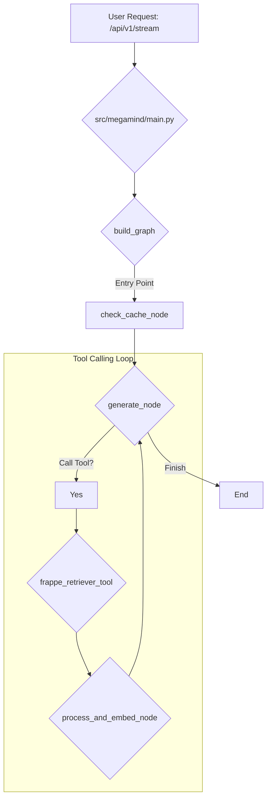

# Codebase Overview

## High-Level Architecture

This application is a FastAPI-based microservice designed to interact with AI models. It uses `langgraph` to create a stateful, multi-actor system that processes user requests in a structured manner. The core of the application is a graph-based state machine that orchestrates the flow of data and logic, from receiving a user's chat message to generating a final response.

The application is designed to be modular, with clear separation of concerns between the API layer, the graph definition, and the individual nodes that make up the graph. This allows for easier maintenance and extension of the application's capabilities.

## Detailed Component Breakdown

### `src/megamind/main.py`

This file serves as the entry point for the application. It initializes the FastAPI application and defines the API endpoints.

-   **`@app.post("/api/v1/stream")`**: This is the primary endpoint for interacting with the AI. It receives a `ChatRequest` object containing the user's prompt. The endpoint is responsible for:
    1.  Invoking the graph with the user's message.
    2.  Streaming the response back to the client using `StreamingResponse`.

### `src/megamind/graph/builder.py`

This file is responsible for constructing the `langgraph` state machine.

-   **`build_graph()`**: This function defines the structure of the graph, including its nodes and edges.
    -   **Nodes**: The graph consists of four main nodes:
        -   `check_cache`: The entry point of the graph, which checks if a response is available in the cache.
        -   `frappe_retriever_tool`: A `ToolNode` that makes the `frappe_retriever` tool available to the graph. This allows the AI model to dynamically decide whether to call the Frappe API to retrieve additional information.
        -   `process_and_embed`: A node that processes and embeds the data retrieved by the `frappe_retriever_tool`.
        -   `generate`: A node that generates the final response. This node can also decide to call the `frappe_retriever_tool` if more information is needed.
    -   **Edges**: The function defines a cyclical flow where the `generate` node can call the `frappe_retriever_tool`, which then sends its output to the `process_and_embed` node, and finally back to the `generate` node. This loop allows the AI to gather information iteratively until it has enough context to generate a complete response.

### `src/megamind/graph/states.py`

This file defines the state object for the agent.

-   **`AgentState`**: A `TypedDict` that represents the state of the graph. It contains fields for the user's question, messages, and other relevant data that is passed between the nodes. This state is updated by each node as the graph is executed.

### `src/megamind/graph/nodes/`

This directory contains the functions that define the logic for each node in the graph.

-   **`check_cache.py`**: The `check_cache_node` function retrieves all teams for the user, checks if a similar question has been answered before for each team, and is available in the cache.
-   **`embedder.py`**: The `embedder_node` function processes the data retrieved from Frappe, cleans the content, and creates embeddings for it.
-   **`generate.py`**: The `generate_node` function is responsible for generating the final response. It takes the retrieved documents and the conversation history as input and uses a language model to generate a coherent and contextually relevant answer. This node can also decide to call the `frappe_retriever_tool` if more information is needed.

### `src/megamind/graph/tools/`

This directory contains tools that can be called by the agent during the graph's execution.

-   **`frappe_retriever.py`**: This file defines the `frappe_retriever` tool, which is responsible for retrieving data from the Frappe API. By defining it as a tool, the AI model can decide to call it dynamically when it needs to fetch additional information to answer a user's query.

### `src/megamind/clients/frappe_client.py`

This file contains the client for interacting with the Frappe API. It handles the authentication and communication with the Frappe server.

### `src/megamind/models/`

This directory contains the data models for the application.

-   **`requests.py`**: Defines the `ChatRequest` model for the data received by the `/api/v1/stream` endpoint.

### `src/megamind/utils/config.py`

This file manages the application's configuration, including loading environment variables and making them available to the rest of the application.

### `src/megamind/utils/logger.py`

This file sets up a centralized logging system for the application using `loguru`. It ensures that all logs are structured and consistent, with support for JSON formatting.

## Visual Representation



## Database Migrations

This project uses the **Supabase CLI** to manage database schema migrations. This approach ensures that database changes are version-controlled and can be applied consistently across different environments.

### Installing the Supabase CLI

To get started, you need to install the Supabase CLI. Follow the instructions for your operating system:

-   **macOS**:
    ```bash
    brew install supabase/tap/supabase
    ```

-   **Windows**:
    ```bash
    scoop bucket add supabase https://github.com/supabase/scoop-bucket.git
    scoop install supabase
    ```

-   **Linux**:
    ```bash
    sudo apt-get update
    sudo apt-get install -y supabase
    ```

-   **npm**:
    ```bash
    npm install -g supabase
    ```

For more details, refer to the [official Supabase documentation](https://supabase.com/docs/guides/cli/getting-started).

### Linking the Project

Before you can manage migrations, you need to link your local repository to your Supabase project. Run the following command and follow the prompts:

```bash
supabase link --project-ref <your-project-id>
```

### Creating a New Migration

To create a new migration file after making changes to your local database schema, use the following command:

```bash
supabase db diff -f <migration_name>
```

This command will generate a new SQL file in the `supabase/migrations` directory that captures the recent changes.

### Applying Migrations

To apply all pending migrations to your local database, run:

```bash
supabase db push
```

To apply migrations to your remote Supabase database, you will need to commit the migration files to your Git repository and push them. The Supabase GitHub integration will automatically apply the migrations.

## Running the Application with Docker

To run the application in a Docker container, you first need to build the Docker image. Make sure you have Docker installed and running on your system.

### Building the Docker Image

To take advantage of Docker's build cache and significantly speed up the build process, especially the dependency installation step, use the following `docker buildx` command:

```bash
docker buildx build --mount=type=cache,target=/root/.cache/pypoetry -t megamind .
```

This command uses a cache mount to store Poetry's downloaded packages between builds, which means that dependencies will not be re-downloaded unless they have changed.

### Running the Docker Container

Once the image is built, you can run it as a container. The application requires environment variables to be set, which can be passed to the container using an `.env` file.

Create a `.env` file in the root of the project with the necessary environment variables. Then, run the following command to start the container:

```bash
docker run --env-file .env -p 8000:8000 megamind
```

This command starts the container, maps port 8000 of the container to port 8000 on your local machine, and loads the environment variables from the `.env` file.
