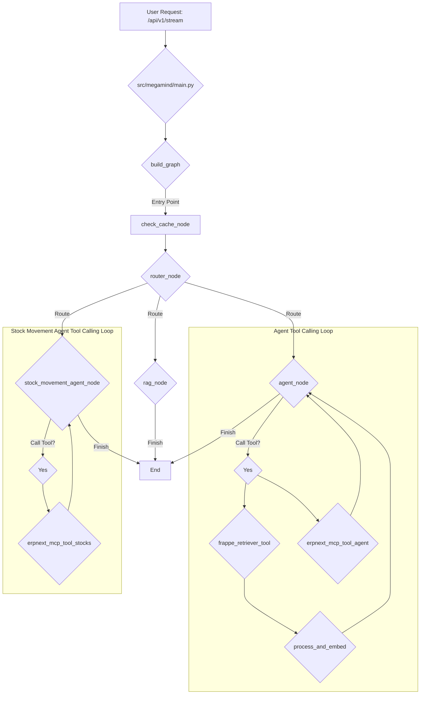

# Codebase Overview

## High-Level Architecture

This application is a FastAPI-based microservice designed to interact with AI models. It uses `langgraph` to create a stateful, multi-actor system that processes user requests in a structured and dynamic manner. The core of the application is a graph-based state machine that orchestrates the flow of data and logic, from receiving a user's chat message to generating a final response.

The graph is designed to be intelligent, with a routing mechanism that determines the best path for a given query. It can choose between a retrieval-augmented generation (RAG) approach for simple, document-based questions, a more complex agentic workflow for tasks that require reasoning and tool use, and a specialized agent for handling stock movement operations. This allows the application to handle a wide range of queries efficiently and effectively.

## Detailed Component Breakdown

### `src/megamind/main.py`

This file serves as the entry point for the application. It initializes the FastAPI application and defines the API endpoints.

-   **`lifespan` context manager**: This function is responsible for initializing the `langgraph` graph when the application starts up, ensuring it is ready to handle requests.
-   **`@app.post("/api/v1/stream")`**: This is the primary endpoint for interacting with the AI. It receives a `ChatRequest` object and streams the response back to the client. It passes the user's message, along with any routing directives, to the graph for processing.
-   **`@app.post("/api/v1/stock-movement/stream")`**: This is a dedicated endpoint for stock movement operations. It directly routes the request to the `stock_movement_agent_node` for faster and more specialized processing.

### `src/megamind/graph/builder.py`

This file is responsible for constructing the `langgraph` state machine.

-   **`build_graph()`**: This function defines the structure of the graph, including its nodes and edges.
    -   **Nodes**: The graph consists of several nodes, each with a specific role:
        -   `check_cache`: The entry point, which first checks if a similar query has been answered before.
        -   `router_node`: A conditional router that decides the next step based on the user's query, directing the flow to either the `rag_node`, the `agent_node`, or the `stock_movement_agent_node`.
        -   `rag_node`: A node that generates a response using a retrieval-augmented generation approach, suitable for straightforward questions.
        -   `agent_node`: A more advanced node that can reason, use tools, and interact with external systems to answer complex queries.
        -   `stock_movement_agent_node`: A specialized agent for handling stock movement and inventory-related tasks.
        -   `frappe_retriever_tool`: A `ToolNode` that allows the agent to retrieve data from the Frappe API.
        -   `erpnext_mcp_tool_agent`: A `ToolNode` for interacting with an ERPNext MCP server, enabling the `agent_node` to perform actions within the ERP system.
        -   `erpnext_mcp_tool_stocks`: A `ToolNode` dedicated to the `stock_movement_agent_node` for inventory-related actions.
        -   `process_and_embed`: A node that processes and creates embeddings for the data retrieved by the `frappe_retriever_tool`.
    -   **Edges**: The function defines a sophisticated flow with conditional routing, allowing the graph to dynamically adapt to the user's request. The `agent_node` and `stock_movement_agent_node` can call tools in a loop, processing the results until they have enough information to generate a final response.

### `src/megamind/graph/states.py`

This file defines the state object for the agent.

-   **`AgentState`**: A `TypedDict` that represents the state of the graph. It contains fields for messages, documents, team IDs, and other data that is passed between nodes.

### `src/megamind/graph/nodes/`

This directory contains the functions that define the logic for each node in the graph.

-   **`check_cache.py`**: The `check_cache_node` function checks for cached responses to similar questions.
-   **`router.py`**: The `router_node` function uses a language model to determine whether a query should be handled by the `rag_node`, `agent_node`, or `stock_movement_agent_node`.
-   **`agent.py`**: The `agent_node` function is the primary reasoning engine of the graph. It can use tools like `frappe_retriever` and the ERPNext MCP to gather information and generate a comprehensive response.
-   **`stock_movement_agent.py`**: The `stock_movement_agent_node` function is a specialized agent for handling inventory-related tasks.
-   **`rag.py`**: The `rag_node` function generates a response based on retrieved documents, suitable for answering factual questions.
-   **`embed.py`**: The `embed_node` function processes and creates embeddings for the data retrieved from Frappe.

### `src/megamind/graph/tools/`

This directory contains tools that can be called by the agent during the graph's execution.

-   **`frappe_retriever.py`**: This file defines the `frappe_retriever` tool, which allows the agent to dynamically fetch data from the Frappe API.
-   **`inventory_tools.py`**: This file contains tools related to inventory management that can be used by the `stock_movement_agent_node`.

### `src/megamind/clients/`

This directory contains clients for interacting with external services.

-   **`frappe_client.py`**: Contains the client for authenticating and communicating with the Frappe API.
-   **`supa_client.py`**: A client for interacting with a Supabase instance.
-   **`manager.py`**: Manages the initialization and retrieval of clients.

### `src/megamind/models/`

This directory contains the data models for the application.

-   **`requests.py`**: Defines the `ChatRequest` model for the data received by the API endpoints.

### `src/megamind/utils/`

This directory contains utility functions for the application.

-   **`config.py`**: Manages the application's configuration, including loading environment variables.
-   **`logger.py`**: Sets up a centralized logging system using `loguru`.

## Visual Representation



## Database Migrations

This project uses the **Supabase CLI** to manage database schema migrations. This approach ensures that database changes are version-controlled and can be applied consistently across different environments.

### Installing the Supabase CLI

To get started, you need to install the Supabase CLI. Follow the instructions for your operating system:

-   **macOS**:
    ```bash
    brew install supabase/tap/supabase
    ```

-   **Windows**:
    ```bash
    scoop bucket add supabase https://github.com/supabase/scoop-bucket.git
    scoop install supabase
    ```

-   **Linux**:
    ```bash
    sudo apt-get update
    sudo apt-get install -y supabase
    ```

-   **npm**:
    ```bash
    npm install -g supabase
    ```

For more details, refer to the [official Supabase documentation](https://supabase.com/docs/guides/cli/getting-started).

### Linking the Project

Before you can manage migrations, you need to link your local repository to your Supabase project. Run the following command and follow the prompts:

```bash
supabase link --project-ref <your-project-id>
```

### Creating a New Migration

To create a new migration file after making changes to your local database schema, use the following command:

```bash
supabase db diff -f <migration_name>
```

This command will generate a new SQL file in the `supabase/migrations` directory that captures the recent changes.

### Applying Migrations

To apply all pending migrations to your local database, run:

```bash
supabase db push
```

To apply migrations to your remote Supabase database, you will need to commit the migration files to your Git repository and push them. The Supabase GitHub integration will automatically apply the migrations.

## Running the Application with Docker

To run the application in a Docker container, you first need to build the Docker image. Make sure you have Docker installed and running on your system.

### Building the Docker Image

To take advantage of Docker's build cache and significantly speed up the build process, especially the dependency installation step, use the following `docker buildx` command:

```bash
docker buildx build --mount=type=cache,target=/root/.cache/pypoetry -t megamind .
```

This command uses a cache mount to store Poetry's downloaded packages between builds, which means that dependencies will not be re-downloaded unless they have changed.

### Running the Docker Container

Once the image is built, you can run it as a container. The application requires environment variables to be set, which can be passed to the container using an `.env` file.

Create a `.env` file in the root of the project with the necessary environment variables. Then, run the following command to start the container:

```bash
docker run --env-file .env -p 8000:8000 megamind
```

This command starts the container, maps port 8000 of the container to port 8000 on your local machine, and loads the environment variables from the `.env` file.
