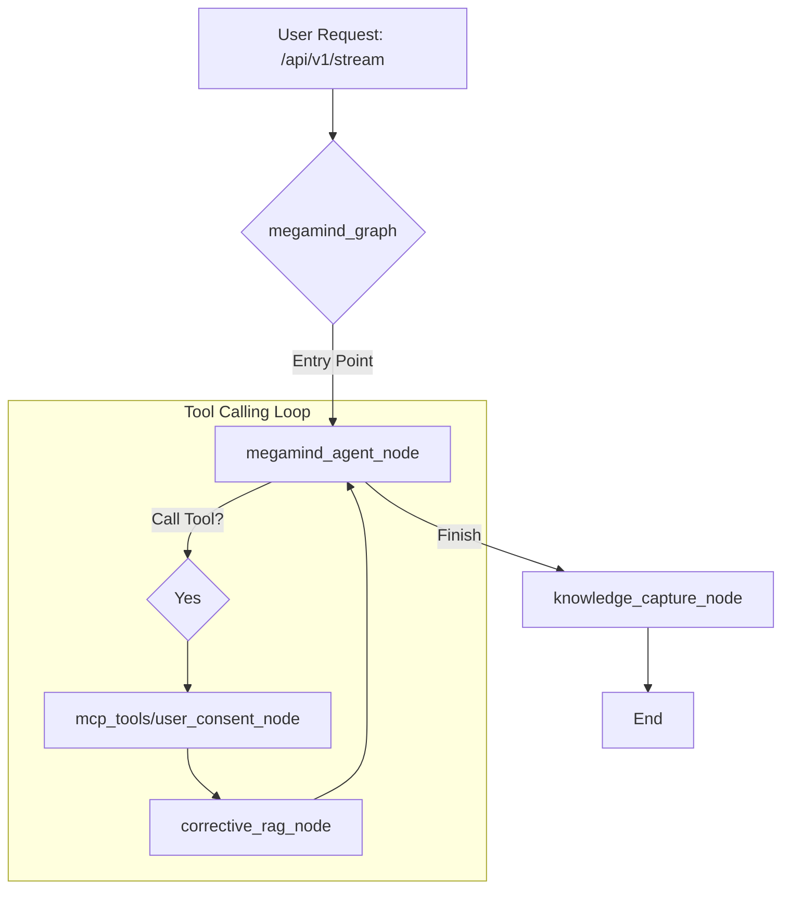
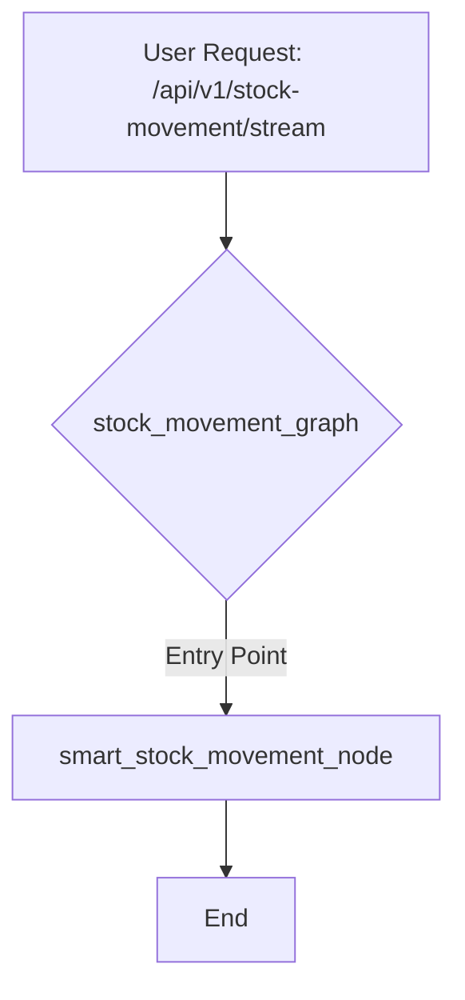
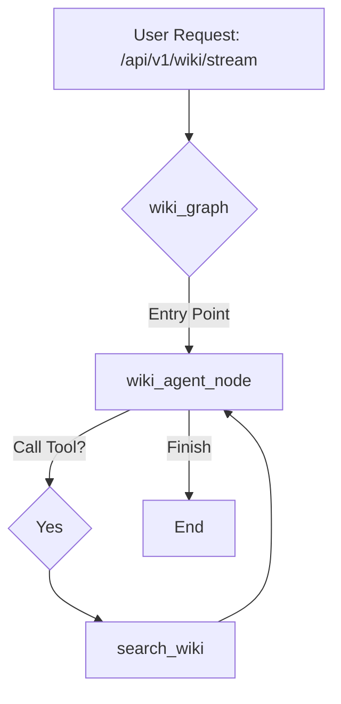
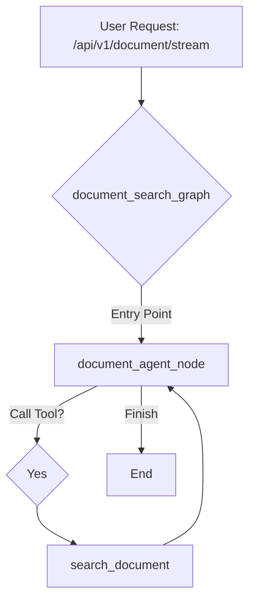

# Codebase Overview

## High-Level Architecture

This application is a FastAPI-based microservice designed to interact with AI models. It uses `langgraph` to create stateful, multi-actor systems that process user requests through structured and dynamic workflows. The core of the application is a set of independent, graph-based state machines, each tailored for a specific business function, such as document retrieval, stock movement, or administrative support.

This modular architecture allows each workflow to be developed and maintained independently, with a clear separation of concerns. The main FastAPI application serves as a router, directing incoming requests to the appropriate graph based on the API endpoint.

## Detailed Component Breakdown

### `src/megamind/main.py`

This file serves as the entry point for the application. It initializes the FastAPI application and defines the API endpoints.

-   **`lifespan` context manager**: This function is responsible for initializing the `langgraph` graphs when the application starts up, ensuring they are ready to handle requests. It builds the following graphs:
    -   `megamind_graph`
    -   `stock_movement_graph`
    -   `wiki_graph`
    -   `document_search_graph`
    -   `role_generation_graph`
-   **API Endpoints**: The application exposes several endpoints, each corresponding to a specific workflow:
    -   **`@app.post("/api/v1/stream/{thread}")`**: Primary endpoint for general queries using `megamind_graph` with "generic" prompt family.
    -   **`@app.post("/api/v1/accounting-finance/stream/{thread}")`**: Endpoint for accounting/finance queries using `megamind_graph` with "accounting_finance" prompt family.
    -   **`@app.post("/api/v1/stock-movement/stream/{thread}")`**: Endpoint for stock movement using `megamind_graph` with "stock_movement" prompt family.
    -   **`@app.post("/api/v1/wiki/stream/{thread_id}")`**: Wiki search endpoint (via `minion_router`) using `wiki_graph`.
    -   **`@app.post("/api/v1/document/stream/{thread_id}")`**: Document search endpoint (via `minion_router`) using `document_search_graph`.
    -   **`@app.post("/api/v1/role-generation")`**: Endpoint for generating role permissions using `role_generation_graph`.
    -   **`@app.post("/api/v1/reconciliation/merge")`**: Utility endpoint for merging bank and customer data (non-graph endpoint).

### `src/megamind/graph/workflows/`

This directory contains the definitions for the various `langgraph` workflows.

#### `megamind_graph.py`

This workflow is designed for general-purpose queries, including retrieval-augmented generation (RAG) and agentic tool use.

-   **Nodes**:
    -   `megamind_agent_node`: The entry point and primary node of the workflow. It can perform actions in the ERPNext system using MCP tools.
    -   `mcp_tools`: A `ToolNode` for interacting with an ERPNext MCP server.
    -   `user_consent_node`: Handles user consent for state-changing operations.
    -   `corrective_rag_node`: Provides error recovery using the CRAG pattern.
    -   `knowledge_capture_node`: Captures valuable insights from conversations.
-   **Flow**: The `megamind_agent_node` is the entry point. It can call MCP tools or request user consent in a loop, with corrective RAG for error recovery. Valuable knowledge is captured at the end of conversations.

#### `stock_movement_graph.py`

This workflow provides an intelligent, single-node solution for processing stock movements.

-   **Node**:
    -   `smart_stock_movement_node`: This single node is responsible for the entire workflow, from extracting the item and quantity from the user's input to creating the stock entry in the ERP system.
-   **Features**:
    -   Requires only the item code and quantity from the user.
    -   Automatically selects the warehouse.
    -   Includes enhanced error handling and Mongolian language support.

#### `wiki_graph.py` and `document_search_graph.py`

These workflows provide simple, single-node solutions for searching the company's wiki and documents, respectively.

-   **Nodes**:
    -   `wiki_agent_node`: The entry point and primary node of the wiki workflow. It uses the `search_wiki` tool to answer user queries.
    -   `document_agent_node`: The entry point and primary node of the document search workflow. It uses the `search_document` tool to answer user queries.

#### `role_generation_graph.py`

This workflow generates ERPNext role permissions based on a user's description by finding a similar existing role and adapting its permissions.

-   **Flow**: Multi-node workflow that finds related roles, generates permissions, and describes them in human-readable format.
-   **Non-streaming**: Unlike other graphs, this one uses `ainvoke()` instead of streaming, returning a complete response at once.

### `src/megamind/graph/nodes/`

This directory contains the functions that define the logic for each node in the graphs. Each subdirectory corresponds to a specific workflow or a set of shared nodes.

-   `minion_agent.py`: This file contains the `wiki_agent_node` and `document_agent_node`, which are responsible for handling wiki and document search queries.

### `src/megamind/graph/tools/`

This directory contains tools that can be called by the agents during the execution of the graphs, such as the `inventory_tools`.

### `src/megamind/clients/`

This directory contains clients for interacting with external services like Frappe and Supabase.

### `src/megamind/api/`

This directory contains the API routing layer, organized by API version.

-   **`v1/minion.py`**: Contains a dedicated APIRouter for "minion" services (wiki and document search). This router:
    -   Exposes `/api/v1/wiki/stream/{thread_id}` and `/api/v1/document/stream/{thread_id}` endpoints
    -   Uses a shared `_handle_minion_stream()` helper function to reduce code duplication
    -   Accepts `MinionRequest` objects (simpler than `ChatRequest`, only requires `question`)
    -   Uses static prompts from `prompts.py` (not the dynamic prompt system)
    -   Initializes system prompts only for new threads by checking `thread_state`
    -   Included in `main.py` via `app.include_router(minion_router, prefix="/api/v1")`

### `src/megamind/models/`

This directory contains Pydantic data models for requests and responses:

-   **`requests.py`**: Defines input models for API endpoints:
    -   `ChatRequest`: For main chat endpoints (generic, stock_movement, accounting_finance). Includes optional `question`, `company`, and `interrupt_response` fields.
    -   `MinionRequest`: For wiki/document search endpoints. Contains only `question` field.
    -   `RoleGenerationRequest`: For role generation endpoint. Contains `role_name` and `user_description`.
-   **`responses.py`**: Defines output models for API responses.

### `src/megamind/prompts.py`

This file contains static prompt templates (strings) for various agents. These are older-style prompts used by specific endpoints:
-   `wiki_agent_instructions` and `document_agent_instructions`: Used by minion endpoints
-   Role generation prompts: `role_generation_agent_instructions`, `permission_description_agent_instructions`

**Note**: The main chat endpoints (`/api/v1/stream`, `/api/v1/stock-movement/stream`, `/api/v1/accounting-finance/stream`) use the **dynamic prompt system** in `src/megamind/dynamic_prompts/` instead of these static prompts.

### `src/megamind/utils/`

This directory contains utility functions for configuration and logging.

### `src/megamind/dynamic_prompts/`

**Note:** This directory was previously intended for a YAML-based dynamic prompt builder but has been deprecated in favor of Python-based prompts in `src/megamind/prompts/`.

### `src/megamind/prompts/`

This directory contains the Python-based prompt definitions for the application. Instead of a complex builder, prompts are defined as Python strings or functions that return formatted strings. This approach offers better type safety and easier integration with the application logic.

-   **`megamind.py`**: Contains the `BASE_SYSTEM_PROMPT` and the `build_system_prompt` function for the main agent. It handles dynamic insertion of context like company name and current datetime.
-   **`minion.py`**: Prompts for the "minion" agents (Wiki and Document search).
-   **`role_generation.py`**: Prompts for the role generation workflow.
-   **`corrective_rag.py`**: Prompts for the Corrective RAG node.
-   **`knowledge_capture.py`**: Prompts for capturing knowledge from conversations.
-   **`document_extraction.py`**: Prompts for extracting structured data from documents.

## Visual Representation

### Megamind Graph



### Stock Movement Graph



### Wiki Graph



### Document Search Graph



## Database Migrations

This project uses the **Supabase CLI** to manage database schema migrations. This approach ensures that database changes are version-controlled and can be applied consistently across different environments.

### Installing the Supabase CLI

To get started, you need to install the Supabase CLI. Follow the instructions for your operating system:

-   **macOS**:
    ```bash
    brew install supabase/tap/supabase
    ```

-   **Windows**:
    ```bash
    scoop bucket add supabase https://github.com/supabase/scoop-bucket.git
    scoop install supabase
    ```

-   **Linux**:
    ```bash
    sudo apt-get update
    sudo apt-get install -y supabase
    ```

-   **npm**:
    ```bash
    npm install -g supabase
    ```

For more details, refer to the [official Supabase documentation](https://supabase.com/docs/guides/cli/getting-started).

### Linking the Project

Before you can manage migrations, you need to link your local repository to your Supabase project. Run the following command and follow the prompts:

```bash
supabase link --project-ref <your-project-id>
```

### Creating a New Migration

To create a new migration file after making changes to your local database schema, use the following command:

```bash
supabase db diff -f <migration_name>
```

This command will generate a new SQL file in the `supabase/migrations` directory that captures the recent changes.

### Applying Migrations

To apply all pending migrations to your local database, run:

```bash
supabase db push
```

To apply migrations to your remote Supabase database, you will need to commit the migration files to your Git repository and push them. The Supabase GitHub integration will automatically apply the migrations.

## Running the Application with Docker

To run the application in a Docker container, you first need to build the Docker image. Make sure you have Docker installed and running on your system.

### Building the Docker Image

To take advantage of Docker's build cache and significantly speed up the build process, especially the dependency installation step, use the following `docker buildx` command:

```bash
docker buildx build --mount=type=cache,target=/root/.cache/pypoetry -t megamind .
```

This command uses a cache mount to store Poetry's downloaded packages between builds, which means that dependencies will not be re-downloaded unless they have changed.

### Running the Docker Container

Once the image is built, you can run it as a container. The application requires environment variables to be set, which can be passed to the container using an `.env` file.

Create a `.env` file in the root of the project with the necessary environment variables. Then, run the following command to start the container:

```bash
docker run --env-file .env -p 8000:8000 megamind
```

This command starts the container, maps port 8000 of the container to port 8000 on your local machine, and loads the environment variables from the `.env` file.

## Testing the Prompt Builder

The project includes a command-line script to test the output of the dynamic prompt builder without running the main FastAPI application. This is useful for debugging and iterating on prompt templates.

### Running the Test Script

To run the script, execute the following command from the root of the project:

```bash
python tests/test_prompt_builder.py
```

By default, this will use the `generic` prompt variant.

### Testing a Specific Variant

You can test other prompt variants by using the `--variant` command-line argument. For example, to test the `stock_movement` variant, run the following command:

```bash
python tests/test_prompt_builder.py --variant stock_movement
```

The script will print the fully assembled and formatted prompt to the console, allowing you to inspect the final output.
