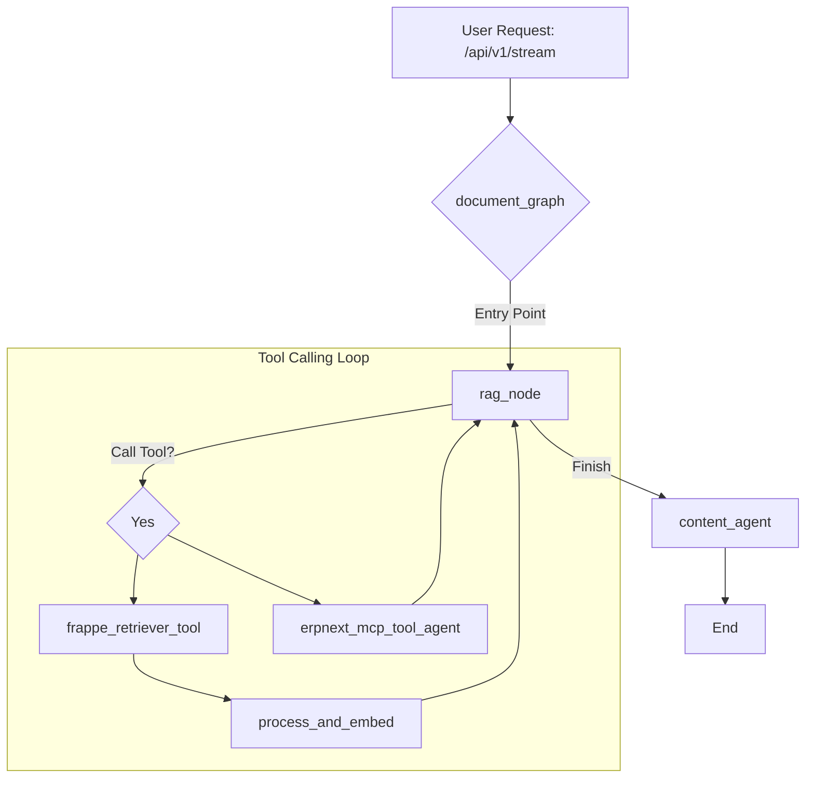
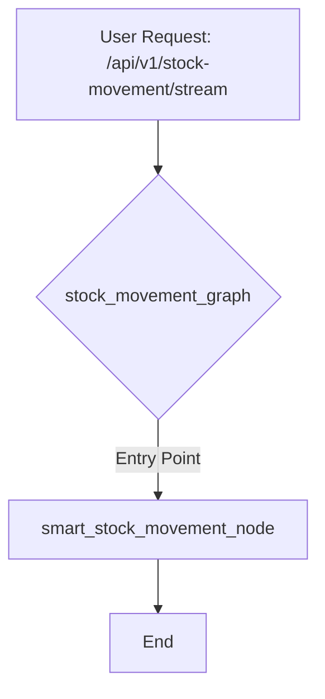

# Codebase Overview

## High-Level Architecture

This application is a FastAPI-based microservice designed to interact with AI models. It uses `langgraph` to create stateful, multi-actor systems that process user requests through structured and dynamic workflows. The core of the application is a set of independent, graph-based state machines, each tailored for a specific business function, such as document retrieval, stock movement, or administrative support.

This modular architecture allows each workflow to be developed and maintained independently, with a clear separation of concerns. The main FastAPI application serves as a router, directing incoming requests to the appropriate graph based on the API endpoint.

## Detailed Component Breakdown

### `src/megamind/main.py`

This file serves as the entry point for the application. It initializes the FastAPI application and defines the API endpoints.

-   **`lifespan` context manager**: This function is responsible for initializing the `langgraph` graphs when the application starts up, ensuring they are ready to handle requests. It builds the following graphs:
    -   `stock_movement_graph`
    -   `document_graph`
    -   `admin_support_graph`
    -   `bank_reconciliation_graph`
-   **API Endpoints**: The application exposes several endpoints, each corresponding to a specific workflow:
    -   **`@app.post("/api/v1/stream")`**: This is the primary endpoint for the document retrieval workflow, which handles general queries.
    -   **`@app.post("/api/v1/stock-movement/stream")`**: A dedicated endpoint for the stock movement workflow.
    -   **`@app.post("/api/v1/admin-support/stream")`**: An endpoint for the administrative support workflow.
    -   **`@app.post("/api/v1/bank-reconciliation/stream")`**: An endpoint for the bank reconciliation workflow.
    -   **`@app.post("/api/v1/reconciliation/merge")`**: A utility endpoint for merging bank and customer data for reconciliation.

### `src/megamind/graph/workflows/`

This directory contains the definitions for the various `langgraph` workflows.

#### `document_graph.py`

This workflow is designed for general-purpose queries, including retrieval-augmented generation (RAG) and agentic tool use. It is a single-node workflow where the `rag_node` is responsible for the entire process.

-   **Nodes**:
    -   `rag_node`: The entry point and primary node of the workflow. It can handle both document-related queries by using the `frappe_retriever` tool and perform actions in the ERPNext system using the `erpnext_mcp_tool_agent`.
    -   `content_agent_node`: A node that refines the content before sending the final response.
    -   `frappe_retriever_tool`: A `ToolNode` for retrieving data from the Frappe API.
    -   `erpnext_mcp_tool_agent`: A `ToolNode` for interacting with an ERPNext MCP server.
    -   `process_and_embed`: Processes and creates embeddings for retrieved data.
-   **Flow**: The `rag_node` is the entry point. It can call tools in a loop, processing the results until it has enough information to generate a final response. The final response is then passed to the `content_agent` for refinement.

#### `stock_movement_graph.py`

This workflow provides an intelligent, single-node solution for processing stock movements.

-   **Node**:
    -   `smart_stock_movement_node`: This single node is responsible for the entire workflow, from extracting the item and quantity from the user's input to creating the stock entry in the ERP system.
-   **Features**:
    -   Requires only the item code and quantity from the user.
    -   Automatically selects the warehouse.
    -   Includes enhanced error handling and Mongolian language support.

#### `admin_support_graph.py` and `bank_reconciliation_graph.py`

These files define the workflows for administrative support and bank reconciliation, respectively. They follow a similar pattern of defining a `StateGraph` with a set of nodes and edges to accomplish their specific tasks.

### `src/megamind/graph/nodes/`

This directory contains the functions that define the logic for each node in the graphs. Each subdirectory corresponds to a specific workflow or a set of shared nodes.

### `src/megamind/graph/tools/`

This directory contains tools that can be called by the agents during the execution of the graphs, such as the `frappe_retriever` and `inventory_tools`.

### `src/megamind/clients/`

This directory contains clients for interacting with external services like Frappe and Supabase.

### `src/megamind/models/`

This directory contains the data models for the application, such as the `ChatRequest` model.

### `src/megamind/utils/`

This directory contains utility functions for configuration and logging.

## Visual Representation

### Document Graph



### Stock Movement Graph



## Database Migrations

This project uses the **Supabase CLI** to manage database schema migrations. This approach ensures that database changes are version-controlled and can be applied consistently across different environments.

### Installing the Supabase CLI

To get started, you need to install the Supabase CLI. Follow the instructions for your operating system:

-   **macOS**:
    ```bash
    brew install supabase/tap/supabase
    ```

-   **Windows**:
    ```bash
    scoop bucket add supabase https://github.com/supabase/scoop-bucket.git
    scoop install supabase
    ```

-   **Linux**:
    ```bash
    sudo apt-get update
    sudo apt-get install -y supabase
    ```

-   **npm**:
    ```bash
    npm install -g supabase
    ```

For more details, refer to the [official Supabase documentation](https://supabase.com/docs/guides/cli/getting-started).

### Linking the Project

Before you can manage migrations, you need to link your local repository to your Supabase project. Run the following command and follow the prompts:

```bash
supabase link --project-ref <your-project-id>
```

### Creating a New Migration

To create a new migration file after making changes to your local database schema, use the following command:

```bash
supabase db diff -f <migration_name>
```

This command will generate a new SQL file in the `supabase/migrations` directory that captures the recent changes.

### Applying Migrations

To apply all pending migrations to your local database, run:

```bash
supabase db push
```

To apply migrations to your remote Supabase database, you will need to commit the migration files to your Git repository and push them. The Supabase GitHub integration will automatically apply the migrations.

## Running the Application with Docker

To run the application in a Docker container, you first need to build the Docker image. Make sure you have Docker installed and running on your system.

### Building the Docker Image

To take advantage of Docker's build cache and significantly speed up the build process, especially the dependency installation step, use the following `docker buildx` command:

```bash
docker buildx build --mount=type=cache,target=/root/.cache/pypoetry -t megamind .
```

This command uses a cache mount to store Poetry's downloaded packages between builds, which means that dependencies will not be re-downloaded unless they have changed.

### Running the Docker Container

Once the image is built, you can run it as a container. The application requires environment variables to be set, which can be passed to the container using an `.env` file.

Create a `.env` file in the root of the project with the necessary environment variables. Then, run the following command to start the container:

```bash
docker run --env-file .env -p 8000:8000 megamind
```

This command starts the container, maps port 8000 of the container to port 8000 on your local machine, and loads the environment variables from the `.env` file.
